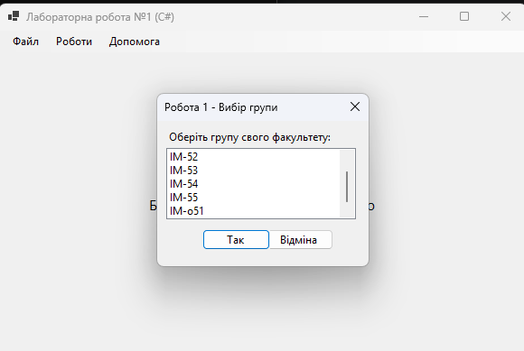

<div style="text-align: center; font-size: 24px; margin-top: 60px;">

Міністерство освіти і науки України

Національний технічний університет України
«Київський політехнічний інститут імені Ігоря Сікорського»

Факультет інформатики та обчислювальної техніки
Кафедра обчислювальної техніки

</div>

<div style="text-align: center; margin-top: 120px;">

<h1 style="font-size: 22px;">Лабораторна робота №1</h1>

<h2 style="font-size: 22px;">з дисципліни «Об'єктно-орієнтоване програмування»</h2>

<h3 style="font-size: 22px; margin-top: 20px;">на тему</h3>

<h2 style="font-size: 22px;">«Знайомство із середовищем розробки програм Microsoft Visual Studio та складання модульних проєктів програм на C#»</h2>

</div>

<div style="text-align: right; margin-top: 120px; font-size: 18px;">

<strong>Виконав:</strong><br>
Мащута Олександр<br>
студент групи IM-051<br>
номер у списку групи: 7<br><br>

<strong>Перевірив:</strong><br>
Рекечинський Дмитро Олександрович

</div>

<div style="text-align: center; margin-top: 120px; font-size: 20px;">

Київ 2026

</div>

---

## Завдання

1. Створити у середовищі MS Visual Studio проєкт WinForms з ім’ям Lab1.
2. Написати вихідний текст програми згідно варіанту завдання.
3. Скомпілювати вихідний текст і отримати виконуваний файл програми.
4. Перевірити роботу програми. Налагодити програму.
5. Проаналізувати та прокоментувати результати та вихідний текст програми.
6. Оформити звіт.

---

## Завдання згідно варіанту

Для студента №7 (Ж = 7) визначено наступні варіанти:

1. **Робота 1 (В1 = Ж mod 4 = 3)**:
   Вікно діалогу з елементом списку (List Box) та двома кнопками: [Так] і [Відміна]. У список автоматично записуються назви груп факультету. Після вибору потрібного рядка списку і натискання [Так], у головному вікні має відображатися текст вибраного рядка списку.

2. **Робота 2 (В2 = (Ж+1) mod 4 = 0)**:
   Вікно діалогу для вводу тексту, яке має стрічку вводу (TextBox) та дві кнопки: [Так] і [Відміна]. Якщо ввести рядок тексту і натиснути [Так], то у головному вікні повинен відображатися введений текст.

---

## Вихідний текст програми

### Головний файл MainWindow.cs

```csharp
using System;
using System.Drawing;
using System.Windows.Forms;

namespace Lab1
{
    public class MainWindow : Form
    {
        private MenuStrip menuStrip;
        private Label lblDisplayText;

        public MainWindow()
        {
            this.Text = "Лабораторна робота №1 (C#)";
            this.Size = new Size(600, 400);
            this.StartPosition = FormStartPosition.CenterScreen;

            menuStrip = new MenuStrip();
            var menuWorks = new ToolStripMenuItem("Роботи");
            var menuHelp = new ToolStripMenuItem("Допомога");
            var menuFile = new ToolStripMenuItem("Файл");

            var itemWork1 = new ToolStripMenuItem("Робота 1", null, OnWork1Clicked);
            var itemWork2 = new ToolStripMenuItem("Робота 2", null, OnWork2Clicked);
            menuWorks.DropDownItems.Add(itemWork1);
            menuWorks.DropDownItems.Add(itemWork2);

            var itemAbout = new ToolStripMenuItem("Про програму...", null, OnAboutClicked);
            menuHelp.DropDownItems.Add(itemAbout);

            var itemExit = new ToolStripMenuItem("Вихід", null, (s, e) => Application.Exit());
            menuFile.DropDownItems.Add(itemExit);

            menuStrip.Items.Add(menuFile);
            menuStrip.Items.Add(menuWorks);
            menuStrip.Items.Add(menuHelp);

            this.MainMenuStrip = menuStrip;
            this.Controls.Add(menuStrip);

            lblDisplayText = new Label
            {
                Text = "Будь ласка, оберіть роботу в меню",
                TextAlign = ContentAlignment.MiddleCenter,
                Dock = DockStyle.Fill,
                Font = new Font("Segoe UI", 12, FontStyle.Regular)
            };
            this.Controls.Add(lblDisplayText);
            lblDisplayText.BringToFront();
        }

        private void OnWork1Clicked(object? sender, EventArgs e)
        {
            using (var form = new Module1Form())
            {
                if (form.ShowDialog() == DialogResult.OK)
                {
                    lblDisplayText.Text = form.Result;
                }
            }
        }

        private void OnWork2Clicked(object? sender, EventArgs e)
        {
            using (var form = new Module2Form())
            {
                if (form.ShowDialog() == DialogResult.OK)
                {
                    lblDisplayText.Text = form.Result;
                }
            }
        }

        private void OnAboutClicked(object? sender, EventArgs e)
        {
            MessageBox.Show("Лабораторна робота №1\nСтудент: Мащута Олександр", "Про програму", MessageBoxButtons.OK, MessageBoxIcon.Information);
        }
    }
}
```

### Модуль 1 (Module1Form.cs)

```csharp
using System;
using System.Drawing;
using System.Windows.Forms;

namespace Lab1
{
    public class Module1Form : Form
    {
        private ListBox lbGroups;
        private Button btnOk;
        private Button btnCancel;

        public string Result { get; private set; } = "";

        public Module1Form()
        {
            this.Text = "Робота 1 - Вибір групи";
            this.Size = new Size(250, 200);
            this.StartPosition = FormStartPosition.CenterParent;
            this.FormBorderStyle = FormBorderStyle.FixedDialog;
            this.MaximizeBox = false;
            this.MinimizeBox = false;

            Label lbl = new Label
            {
                Text = "Оберіть групу свого факультету:",
                Location = new Point(10, 10),
                AutoSize = true
            };

            lbGroups = new ListBox
            {
                Location = new Point(10, 30),
                Size = new Size(210, 80)
            };

            string[] groups = { "IM-051", "IM-052", "IM-053", "IM-054", "IM-055", "IM-056" };
            foreach (var group in groups) lbGroups.Items.Add(group);
            if (lbGroups.Items.Count > 0) lbGroups.SelectedIndex = 0;

            btnOk = new Button
            {
                Text = "Так",
                Location = new Point(50, 120),
                DialogResult = DialogResult.OK
            };

            btnCancel = new Button
            {
                Text = "Відміна",
                Location = new Point(120, 120),
                DialogResult = DialogResult.Cancel
            };

            btnOk.Click += (s, e) =>
            {
                if (lbGroups.SelectedItem != null)
                {
                    Result = lbGroups.SelectedItem?.ToString() ?? "";
                    this.Close();
                }
            };

            this.Controls.Add(lbl);
            this.Controls.Add(lbGroups);
            this.Controls.Add(btnOk);
            this.Controls.Add(btnCancel);
            this.AcceptButton = btnOk;
            this.CancelButton = btnCancel;
        }
    }
}
```

### Модуль 2 (Module2Form.cs)

```csharp
using System;
using System.Drawing;
using System.Windows.Forms;

namespace Lab1
{
    public class Module2Form : Form
    {
        private TextBox txtInput;
        private Button btnOk;
        private Button btnCancel;

        public string Result { get; private set; } = "";

        public Module2Form()
        {
            this.Text = "Робота 2 - Введення тексту";
            this.Size = new Size(250, 150);
            this.StartPosition = FormStartPosition.CenterParent;
            this.FormBorderStyle = FormBorderStyle.FixedDialog;
            this.MaximizeBox = false;
            this.MinimizeBox = false;

            Label lbl = new Label
            {
                Text = "Введіть текст:",
                Location = new Point(10, 10),
                AutoSize = true
            };

            txtInput = new TextBox
            {
                Location = new Point(10, 30),
                Size = new Size(210, 20)
            };

            btnOk = new Button
            {
                Text = "Так",
                Location = new Point(50, 70),
                DialogResult = DialogResult.OK
            };

            btnCancel = new Button
            {
                Text = "Відміна",
                Location = new Point(120, 70),
                DialogResult = DialogResult.Cancel
            };

            btnOk.Click += (s, e) =>
            {
                Result = txtInput.Text;
                this.Close();
            };

            this.Controls.Add(lbl);
            this.Controls.Add(txtInput);
            this.Controls.Add(btnOk);
            this.Controls.Add(btnCancel);
            this.AcceptButton = btnOk;
            this.CancelButton = btnCancel;
        }
    }
}
```

---

## Діаграми

### Структура проєкту та залежності

Проєкт реалізовано на C# WinForms, структура є більш спрощеною завдяки автоматичному управлінню ресурсами та використанню .NET SDK:

```
Lab1 (Project)
├── Program.cs (Entry Point)
├── MainWindow.cs (Main UI)
├── Module1Form.cs (Dialog 1)
└── Module2Form.cs (Dialog 2)
```

---

## Скріншоти

### Головне вікно програми

_Рис. 1. Головне вікно програми з меню «Роботи» та «Допомога»_

---

### Вікно діалогу «Робота 1»

_Рис. 2. Вікно діалогу модуля 1 — вибір групи з ListBox_

---

### Результат роботи «Робота 1»

_Рис. 3. Виведення обраної групи у головному вікні_

---

### Вікно діалогу «Робота 2»

_Рис. 4. Вікно діалогу модуля 2 — введення тексту через TextBox_

---

### Результат роботи «Робота 2»

_Рис. 5. Виведення введеного тексту у головному вікні_

---

## Висновки

У цій лабораторній роботі я реалізував модульний проєкт на мові програмування C# з використанням технології Windows Forms.

Завдяки використанню C#, процес розробки графічного інтерфейсу був значно прискорений порівняно з Win32 API. Я навчився створювати головне вікно програми, організовувати навігацію через меню та взаємодіяти з користувачем за допомогою модальних вікон.

Було реалізовано два різних типи взаємодії: вибір даних зі списку (`ListBox`) та вільне введення тексту (`TextBox`). Всі діалогові вікна були реалізовані як окремі класи, що забезпечило чітку модульність та розділення відповідальності в програмі.

Ця робота дозволила мені закріпити базові принципи ООП, такі як інкапсуляція даних у класах форм та використання властивостей для передачі результатів між вікнами.