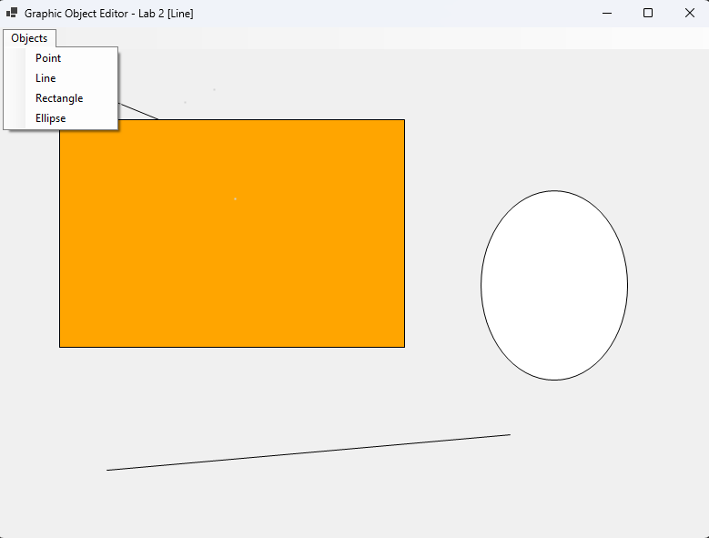

<div style="text-align: center; font-size: 24px; margin-top: 60px;">

Міністерство освіти і науки України

Національний технічний університет України
«Київський політехнічний інститут імені Ігоря Сікорського»

Факультет інформатики та обчислювальної техніки
Кафедра обчислювальної техніки

</div>

<div style="text-align: center; margin-top: 120px;">

<h1 style="font-size: 22px;">Лабораторна робота №2</h1>

<h2 style="font-size: 22px;">з дисципліни «Об'єктно-орієнтоване програмування»</h2>

<h3 style="font-size: 22px; margin-top: 20px;">на тему</h3>

<h2 style="font-size: 22px;">«Графічний редактор об'єктів та ієрархія класів»</h2>

</div>

<div style="text-align: right; margin-top: 120px; font-size: 18px;">

<strong>Виконав:</strong><br>
Мащута Олександр<br>
студент групи IM-051<br>
номер у списку групи: 7<br><br>

<strong>Перевірив:</strong><br>
Рекечинський Дмитро Олександрович

</div>

<div style="text-align: center; margin-top: 120px; font-size: 20px;">

Київ 2026

</div>

---

## Завдання

1. Створити у середовищі MS Visual Studio проєкт WinForms з ім’ям Lab2.
2. Реалізувати базовий абстрактний клас `Shape` та похідні класи графічних об'єктів.
3. Реалізувати графічний редактор з можливістю вибору інструменту через меню.
4. Забезпечити відображення "гумового" сліду під час перетягування миші.
5. Налагодити програму, перевірити поліморфне виведення створених об'єктів.
6. Оформити звіт.

---

## Завдання згідно варіанту

Для студента №7 (Ж = 7) визначено наступні параметри реалізації:
1. **Зберігання об'єктів**: Динамічний масив (`List<Shape>`), що підтримує поліморфний викликів методів малювання.
2. **"Гумовий" слід**: Реалізований під час переміщення курсора миші при затиснутій лівій кнопці (подія `MouseMove`).
3. **Кольори та стилі**:
   - Крапка (`PointShape`): заповнений квадрат 2x2.
   - Лінія (`LineShape`): суцільна чорна лінія.
   - Прямокутник (`RectShape`): помаранчеве заповнення (`Brushes.Orange`) з чорним контуром.
   - Еліпс (`EllipseShape`): біле заповнення (`Brushes.White`) з чорним контуром.
4. **Централізація створення**: Створення об'єктів винесено в static-фабрику `CreateShape`, а колір — у `GetFillBrush`, що забезпечує дотримання принципу Open/Closed (OCP).

---

## Вихідний текст програми

### Базовий клас Shape (Shape.cs)

```csharp
using System.Drawing;

namespace Lab2.Shapes
{
    public abstract class Shape
    {
        public int X1 { get; set; }
        public int Y1 { get; set; }
        public int X2 { get; set; }
        public int Y2 { get; set; }

        public Shape(int x1, int y1, int x2, int y2)
        {
            X1 = x1;
            Y1 = y1;
            X2 = x2;
            Y2 = y2;
        }

        public abstract void Draw(Graphics g, Pen pen, Brush brush);
    }
}
```

### Похідний клас PointShape (PointShape.cs)

```csharp
using System.Drawing;

namespace Lab2.Shapes
{
    public class PointShape : Shape
    {
        public PointShape(int x1, int y1, int x2, int y2) : base(x1, y1, x2, y2) { }

        public override void Draw(Graphics g, Pen pen, Brush brush)
        {
            g.FillRectangle(brush, X1, Y1, 2, 2);
        }
    }
}
```

### Похідний клас LineShape (LineShape.cs)

```csharp
using System.Drawing;

namespace Lab2.Shapes
{
    public class LineShape : Shape
    {
        public LineShape(int x1, int y1, int x2, int y2) : base(x1, y1, x2, y2) { }

        public override void Draw(Graphics g, Pen pen, Brush brush)
        {
            g.DrawLine(pen, X1, Y1, X2, Y2);
        }
    }
}
```

### Похідний клас RectShape (RectShape.cs)

```csharp
using System.Drawing;

namespace Lab2.Shapes
{
    public class RectShape : Shape
    {
        public RectShape(int x1, int y1, int x2, int y2) : base(x1, y1, x2, y2) { }

        public override void Draw(Graphics g, Pen pen, Brush brush)
        {
            int x = Math.Min(X1, X2);
            int y = Math.Min(Y1, Y2);
            int w = Math.Abs(X1 - X2);
            int h = Math.Abs(Y1 - Y2);

            g.FillRectangle(brush, x, y, w, h);
            g.DrawRectangle(pen, x, y, w, h);
        }
    }
}
```

### Похідний клас EllipseShape (EllipseShape.cs)

```csharp
using System.Drawing;

namespace Lab2.Shapes
{
    public class EllipseShape : Shape
    {
        public EllipseShape(int x1, int y1, int x2, int y2) : base(x1, y1, x2, y2) { }

        public override void Draw(Graphics g, Pen pen, Brush brush)
        {
            int x = Math.Min(X1, X2);
            int y = Math.Min(Y1, Y2);
            int w = Math.Abs(X1 - X2);
            int h = Math.Abs(Y1 - Y2);

            g.FillEllipse(brush, x, y, w, h);
            g.DrawEllipse(pen, x, y, w, h);
        }
    }
}
```

### Головне вікно MainWindow.cs

```csharp
using System;
using System.Collections.Generic;
using System.Drawing;
using System.Windows.Forms;
using Lab2.Shapes;

namespace Lab2
{
    public class MainWindow : Form
    {
        private enum ShapeType { Point, Line, Rectangle, Ellipse }
        private ShapeType _currentType = ShapeType.Line;
        private List<Shape> _shapes = new List<Shape>();

        private Point _startPoint;
        private Point _currentPoint;
        private bool _isDrawing = false;

        private MenuStrip? _menuStrip;

        public MainWindow()
        {
            this.Text = "Graphic Object Editor - Lab 2";
            this.Size = new Size(800, 600);
            this.DoubleBuffered = true; // Prevent flickering

            InitializeMenu();
        }

        private void InitializeMenu()
        {
            _menuStrip = new MenuStrip();
            var objectsMenu = new ToolStripMenuItem("Objects");

            objectsMenu.DropDownItems.Add("Point", null, (s, e) => { _currentType = ShapeType.Point; UpdateTitle(); });
            objectsMenu.DropDownItems.Add("Line", null, (s, e) => { _currentType = ShapeType.Line; UpdateTitle(); });
            objectsMenu.DropDownItems.Add("Rectangle", null, (s, e) => { _currentType = ShapeType.Rectangle; UpdateTitle(); });
            objectsMenu.DropDownItems.Add("Ellipse", null, (s, e) => { _currentType = ShapeType.Ellipse; UpdateTitle(); });

            _menuStrip.Items.Add(objectsMenu);
            this.MainMenuStrip = _menuStrip;
            this.Controls.Add(_menuStrip);

            UpdateTitle();
        }

        private void UpdateTitle()
        {
            this.Text = $"Graphic Object Editor - Lab 2 [{_currentType}]";
        }

        private static Shape CreateShape(ShapeType type, Point start, Point end) => type switch
        {
            ShapeType.Point => new PointShape(start.X, start.Y, end.X, end.Y),
            ShapeType.Line => new LineShape(start.X, start.Y, end.X, end.Y),
            ShapeType.Rectangle => new RectShape(start.X, start.Y, end.X, end.Y),
            ShapeType.Ellipse => new EllipseShape(start.X, start.Y, end.X, end.Y),
            _ => throw new ArgumentOutOfRangeException(nameof(type))
        };

        private static Brush GetFillBrush(Shape shape) => shape switch
        {
            RectShape => Brushes.Orange,
            EllipseShape => Brushes.White,
            _ => Brushes.LightGray
        };

        protected override void OnMouseDown(MouseEventArgs e)
        {
            base.OnMouseDown(e);
            if (e.Button == MouseButtons.Left)
            {
                _isDrawing = true;
                _startPoint = e.Location;
                _currentPoint = e.Location;
            }
        }

        protected override void OnMouseMove(MouseEventArgs e)
        {
            base.OnMouseMove(e);
            if (_isDrawing)
            {
                _currentPoint = e.Location;
                this.Invalidate();
            }
        }

        protected override void OnMouseUp(MouseEventArgs e)
        {
            base.OnMouseUp(e);
            if (_isDrawing && e.Button == MouseButtons.Left)
            {
                _isDrawing = false;
                _shapes.Add(CreateShape(_currentType, _startPoint, e.Location));
                this.Invalidate();
            }
        }

        protected override void OnPaint(PaintEventArgs e)
        {
            base.OnPaint(e);
            Graphics g = e.Graphics;
            g.SmoothingMode = System.Drawing.Drawing2D.SmoothingMode.AntiAlias;

            using (Pen pen = new Pen(Color.Black, 1))
            {
                foreach (var shape in _shapes)
                {
                    shape.Draw(g, pen, GetFillBrush(shape));
                }

                if (_isDrawing)
                {
                    using (Pen rubberPen = new Pen(Color.Gray, 1) { DashStyle = System.Drawing.Drawing2D.DashStyle.Dash })
                    using (Brush rubberBrush = new SolidBrush(Color.FromArgb(100, Color.LightGray)))
                    {
                        Shape rubberShape = CreateShape(_currentType, _startPoint, _currentPoint);
                        rubberShape.Draw(g, rubberPen, rubberBrush);
                    }
                }
            }
        }
    }
}
```

---

## Діаграми

### Структура файлів проєкту

```
Lab2
├── Program.cs
├── MainWindow.cs
└── src/
    ├── Shape.cs
    ├── PointShape.cs
    ├── LineShape.cs
    ├── RectShape.cs
    └── EllipseShape.cs
```

### Діаграма класів (UML)

```
┌─────────────────────────────────────────┐
│            Shape (abstract)             │
├─────────────────────────────────────────┤
│ + X1, Y1, X2, Y2 : int                  │
├─────────────────────────────────────────┤
│ + Draw(g: Graphics, pen: Pen, b: Brush) │
└────────────────────┬────────────────────┘
                     │
    ┌────────────────┼────────────────┬────────────────┐
┌───▼───────┐  ┌─────▼─────┐  ┌───────▼──────┐  ┌──────▼───────┐
│PointShape │  │ LineShape │  │  RectShape   │  │ EllipseShape │
└───────────┘  └───────────┘  └──────────────┘  └──────────────┘
```

---

## Скріншоти

### Головне вікно програми

_Рис. 1. Головне вікно програми з меню «Objects»_

## Висновки

У цій лабораторній роботі я реалізував графічний редактор об'єктів на C# WinForms із застосуванням основних принципів об'єктно-орієнтованого програмування.

Було побудовано ієрархію класів із базовим абстрактним класом `Shape` та чотирма похідними класами (`PointShape`, `LineShape`, `RectShape`, `EllipseShape`). Використання поліморфізму дозволило організувати єдиний список зберігання об'єктів `List<Shape>` та здійснювати перемалювання вікна викликом віртуального/абстрактного методу `Draw` без розгалужень за типами.

Також було реалізовано механізм "гумового" сліду для візуалізації фігури в процесі перетягування миші та застосовано паттерн "Фабричний метод" (`CreateShape`) для централізації створення об'єктів.
