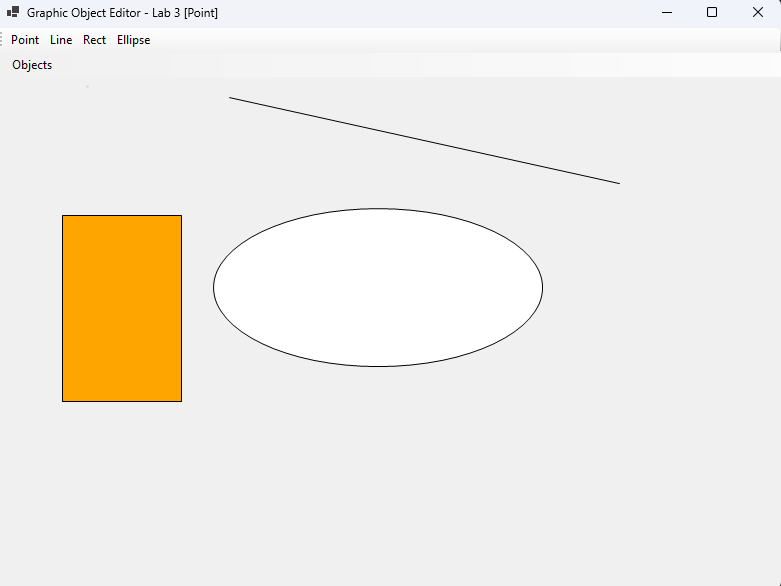

<div style="text-align: center; font-size: 24px; margin-top: 60px;">

Міністерство освіти і науки України

Національний технічний університет України
«Київський політехнічний інститут імені Ігоря Сікорського»

Факультет інформатики та обчислювальної техніки
Кафедра обчислювальної техніки

</div>

<div style="text-align: center; margin-top: 120px;">

<h1 style="font-size: 22px;">Лабораторна робота №3</h1>

<h2 style="font-size: 22px;">з дисципліни «Об'єктно-орієнтоване програмування»</h2>

<h3 style="font-size: 22px; margin-top: 20px;">на тему</h3>

<h2 style="font-size: 22px;">«Інтерфейс користувача та панель інструментів (Toolbar)»</h2>

</div>

<div style="text-align: right; margin-top: 120px; font-size: 18px;">

<strong>Виконав:</strong><br>
Мащута Олександр<br>
студент групи IM-051<br>
номер у списку групи: 7<br><br>

<strong>Перевірив:</strong><br>
Рекечинський Дмитро Олександрович

</div>

<div style="text-align: center; margin-top: 120px; font-size: 20px;">

Київ 2026

</div>

---

## Завдання

1. Створити у середовищі MS Visual Studio проєкт WinForms з ім’ям Lab3.
2. Додати до графічного редактора панель інструментів (Toolbar) з використанням компонента `ToolStrip`.
3. Реалізувати підказки (`ToolTipText`) для кнопок панелі інструментів.
4. Забезпечити повну синхронізацію стану між пунктами меню та кнопками на Toolbar.
5. Налагодити програму, перевірити зручність користувацького інтерфейсу.
6. Оформити звіт.

---

## Завдання згідно варіанту

Для студента №7 (Ж = 7) визначено наступні вимоги:
1. **Панель інструментів**: Чотири кнопки вибору графічних примітивів (`Point`, `Line`, `Rect`, `Ellipse`).
2. **Підказки (Tooltips)**: Спливаючі текстові підказки з описом дії кожної кнопки ("Draw a Point", "Draw a Line", "Draw a Rectangle", "Draw an Ellipse").
3. **Синхронізація**: Переключення графічного інструмента через Toolbar оновлює заголовок головного вікна та стан вибраного примітива аналогічно вибору через головне меню.

---

## Вихідний текст програми

### Головний файл MainWindow.cs

```csharp
using System;
using System.Collections.Generic;
using System.Drawing;
using System.Windows.Forms;
using Lab3.Shapes;

namespace Lab3
{
    public class MainWindow : Form
    {
        private enum ShapeType { Point, Line, Rectangle, Ellipse }
        private ShapeType _currentType = ShapeType.Line;
        private List<Shape> _shapes = new List<Shape>();

        private Point _startPoint;
        private Point _currentPoint;
        private bool _isDrawing = false;

        private MenuStrip? _menuStrip;
        private ToolStrip? _toolStrip;

        public MainWindow()
        {
            this.Text = "Graphic Object Editor - Lab 3";
            this.Size = new Size(800, 600);
            this.DoubleBuffered = true;

            InitializeMenu();
            InitializeToolbar();
        }

        private void InitializeMenu()
        {
            _menuStrip = new MenuStrip();
            var objectsMenu = new ToolStripMenuItem("Objects");

            objectsMenu.DropDownItems.Add("Point", null, (s, e) => { _currentType = ShapeType.Point; UpdateTitle(); });
            objectsMenu.DropDownItems.Add("Line", null, (s, e) => { _currentType = ShapeType.Line; UpdateTitle(); });
            objectsMenu.DropDownItems.Add("Rectangle", null, (s, e) => { _currentType = ShapeType.Rectangle; UpdateTitle(); });
            objectsMenu.DropDownItems.Add("Ellipse", null, (s, e) => { _currentType = ShapeType.Ellipse; UpdateTitle(); });

            _menuStrip.Items.Add(objectsMenu);
            this.MainMenuStrip = _menuStrip;
            this.Controls.Add(_menuStrip);

            UpdateTitle();
        }

        private void InitializeToolbar()
        {
            _toolStrip = new ToolStrip();

            var btnPoint = new ToolStripButton("Point") { ToolTipText = "Draw a Point" };
            btnPoint.Click += (s, e) => { _currentType = ShapeType.Point; UpdateTitle(); };

            var btnLine = new ToolStripButton("Line") { ToolTipText = "Draw a Line" };
            btnLine.Click += (s, e) => { _currentType = ShapeType.Line; UpdateTitle(); };

            var btnRect = new ToolStripButton("Rect") { ToolTipText = "Draw a Rectangle" };
            btnRect.Click += (s, e) => { _currentType = ShapeType.Rectangle; UpdateTitle(); };

            var btnEllipse = new ToolStripButton("Ellipse") { ToolTipText = "Draw an Ellipse" };
            btnEllipse.Click += (s, e) => { _currentType = ShapeType.Ellipse; UpdateTitle(); };

            _toolStrip.Items.Add(btnPoint);
            _toolStrip.Items.Add(btnLine);
            _toolStrip.Items.Add(btnRect);
            _toolStrip.Items.Add(btnEllipse);

            this.Controls.Add(_toolStrip);
        }

        private void UpdateTitle()
        {
            this.Text = $"Graphic Object Editor - Lab 3 [{_currentType}]";
        }

        private static Shape CreateShape(ShapeType type, Point start, Point end) => type switch
        {
            ShapeType.Point => new PointShape(start.X, start.Y, end.X, end.Y),
            ShapeType.Line => new LineShape(start.X, start.Y, end.X, end.Y),
            ShapeType.Rectangle => new RectShape(start.X, start.Y, end.X, end.Y),
            ShapeType.Ellipse => new EllipseShape(start.X, start.Y, end.X, end.Y),
            _ => throw new ArgumentOutOfRangeException(nameof(type))
        };

        private static Brush GetFillBrush(Shape shape) => shape switch
        {
            RectShape => Brushes.Orange,
            EllipseShape => Brushes.White,
            _ => Brushes.LightGray
        };

        protected override void OnMouseDown(MouseEventArgs e)
        {
            base.OnMouseDown(e);
            if (e.Button == MouseButtons.Left)
            {
                _isDrawing = true;
                _startPoint = e.Location;
                _currentPoint = e.Location;
            }
        }

        protected override void OnMouseMove(MouseEventArgs e)
        {
            base.OnMouseMove(e);
            if (_isDrawing)
            {
                _currentPoint = e.Location;
                this.Invalidate();
            }
        }

        protected override void OnMouseUp(MouseEventArgs e)
        {
            base.OnMouseUp(e);
            if (_isDrawing && e.Button == MouseButtons.Left)
            {
                _isDrawing = false;
                _shapes.Add(CreateShape(_currentType, _startPoint, e.Location));
                this.Invalidate();
            }
        }

        protected override void OnPaint(PaintEventArgs e)
        {
            base.OnPaint(e);
            Graphics g = e.Graphics;
            g.SmoothingMode = System.Drawing.Drawing2D.SmoothingMode.AntiAlias;

            using (Pen pen = new Pen(Color.Black, 1))
            {
                foreach (var shape in _shapes)
                {
                    shape.Draw(g, pen, GetFillBrush(shape));
                }

                if (_isDrawing)
                {
                    using (Pen rubberPen = new Pen(Color.Gray, 1) { DashStyle = System.Drawing.Drawing2D.DashStyle.Dash })
                    using (Brush rubberBrush = new SolidBrush(Color.FromArgb(100, Color.LightGray)))
                    {
                        Shape rubberShape = CreateShape(_currentType, _startPoint, _currentPoint);
                        rubberShape.Draw(g, rubberPen, rubberBrush);
                    }
                }
            }
        }
    }
}
```

### Модуль Shape (Shape.cs)

```csharp
using System.Drawing;

namespace Lab3.Shapes
{
    public abstract class Shape
    {
        public int X1 { get; set; }
        public int Y1 { get; set; }
        public int X2 { get; set; }
        public int Y2 { get; set; }

        public Shape(int x1, int y1, int x2, int y2)
        {
            X1 = x1;
            Y1 = y1;
            X2 = x2;
            Y2 = y2;
        }

        public abstract void Draw(Graphics g, Pen pen, Brush brush);
    }
}
```

---

## Діаграми

### Структура файлів та залежності

```
Lab3
├── Program.cs
├── MainWindow.cs
└── src/
    ├── Shape.cs
    ├── PointShape.cs
    ├── LineShape.cs
    ├── RectShape.cs
    └── EllipseShape.cs
```

### Діаграма класів (UML)

```
┌─────────────────────────────────────────┐
│            Shape (abstract)             │
├─────────────────────────────────────────┤
│ + X1, Y1, X2, Y2 : int                  │
├─────────────────────────────────────────┤
│ + Draw(g: Graphics, pen: Pen, b: Brush) │
└────────────────────┬────────────────────┘
                     │
    ┌────────────────┼────────────────┬────────────────┐
┌───▼───────┐  ┌─────▼─────┐  ┌───────▼──────┐  ┌──────▼───────┐
│PointShape │  │ LineShape │  │  RectShape   │  │ EllipseShape │
└───────────┘  └───────────┘  └──────────────┘  └──────────────┘
```

---

## Скріншоти

### Головне вікно з панеллю інструментів (Toolbar)

_Рис. 1. Панель інструментів ToolStrip з кнопками швидкого доступу_

## Висновки

У цій лабораторній роботі я вдосконалив графічний редактор шляхом додавання панелі інструментів (Toolbar) на основі компонента `ToolStrip` та реалізації спливаючих підказок `ToolTipText`.

Було забезпечено зручний швидкий доступ до основних графічних примітивів та синхронізовано стан кнопок Toolbar з головним меню програми та заголовком вікна. Це покращило ергономіку графічного інтерфейсу та зробило процес малювання більш інтуїтивним.
