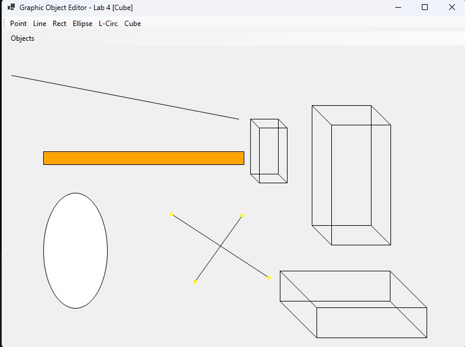

<div style="text-align: center; font-size: 24px; margin-top: 60px;">

Міністерство освіти і науки України

Національний технічний університет України
«Київський політехнічний інститут імені Ігоря Сікорського»

Факультет інформатики та обчислювальної техніки
Кафедра обчислювальної техніки

</div>

<div style="text-align: center; margin-top: 120px;">

<h1 style="font-size: 22px;">Лабораторна робота №4</h1>

<h2 style="font-size: 22px;">з дисципліни «Об'єктно-орієнтоване програмування»</h2>

<h3 style="font-size: 22px; margin-top: 20px;">на тему</h3>

<h2 style="font-size: 22px;">«Рефакторинг та складні об'єкти з множинним успадкуванням»</h2>

</div>

<div style="text-align: right; margin-top: 120px; font-size: 18px;">

<strong>Виконав:</strong><br>
Мащута Олександр<br>
студент групи IM-051<br>
номер у списку групи: 7<br><br>

<strong>Перевірив:</strong><br>
Рекечинський Дмитро Олександрович

</div>

<div style="text-align: center; margin-top: 120px; font-size: 20px;">

Київ 2026

</div>

---

## Завдання

1. Виконати рефакторинг графічного редактора з виділенням класу `MyEditor` для керування об'єктами.
2. Реалізувати C#-аналог множинного успадкування поведінок базових класів для складених фігур.
3. Реалізувати складний графічний об'єкт «Лінія з кружечками» (`LineWithCirclesShape`).
4. Реалізувати складний графічний об'єкт «Каркас куба» (`CubeWireframeShape`).
5. Додати нові фігури до меню та розширити панель інструментів Toolbar до 6 кнопок.
6. Оформити звіт.

---

## Завдання згідно варіанту

Для студента №7 (Ж = 7):
1. **Рефакторинг**: Клас `MyEditor` акумулює логіку зберігання (`List<Shape>`), очищення та малювання всіх створених об'єктів.
2. **Множинне успадкування в C#**: Оскільки C# не підтримує множинне успадкування класів, реалізовано C#-аналог за допомогою **інтерфейсів із методами за замовчуванням (Default Interface Methods, C# 8+)**:
   - `ILineBehavior`: визначає поведінку малювання відрізка лінії.
   - `IEllipseBehavior`: визначає поведінку заповнення еліпса та кружечків.
   - `IRectBehavior`: визначає поведінку заповнення прямокутника та контуру.
3. **Складені фігури**:
   - `LineWithCirclesShape`: успадковує `Shape` та реалізує `ILineBehavior` + `IEllipseBehavior`.
   - `CubeWireframeShape`: успадковує `Shape` та реалізує `ILineBehavior` + `IRectBehavior`.

---

## Вихідний текст програми

### Точка входу Program.cs

```csharp
using System;
using System.Windows.Forms;

namespace Lab4
{
    internal static class Program
    {
        [STAThread]
        static void Main()
        {
            ApplicationConfiguration.Initialize();
            Application.Run(new MainWindow());
        }
    }
}
```

### Головне вікно MainWindow.cs

```csharp
using System;
using System.Drawing;
using System.Windows.Forms;
using Lab4.Shapes;

namespace Lab4;

public class MainWindow : Form
{
    private enum ShapeType { Point, Line, Rectangle, Ellipse, LineCircles, Cube }
    private ShapeType _currentType = ShapeType.Line;
    private readonly MyEditor _editor = new();

    private Point _startPoint;
    private Point _currentPoint;
    private bool _isDrawing;

    private MenuStrip? _menuStrip;
    private ToolStrip? _toolStrip;

    public MainWindow()
    {
        Text = "Graphic Object Editor - Lab 4 (.NET 8 Refactored)";
        Size = new Size(800, 600);
        DoubleBuffered = true;

        InitializeMenu();
        InitializeToolbar();
    }

    private void InitializeMenu()
    {
        _menuStrip = new MenuStrip();
        var objectsMenu = new ToolStripMenuItem("Objects");

        objectsMenu.DropDownItems.Add("Point", null, (_, _) => { _currentType = ShapeType.Point; UpdateTitle(); });
        objectsMenu.DropDownItems.Add("Line", null, (_, _) => { _currentType = ShapeType.Line; UpdateTitle(); });
        objectsMenu.DropDownItems.Add("Rectangle", null, (_, _) => { _currentType = ShapeType.Rectangle; UpdateTitle(); });
        objectsMenu.DropDownItems.Add("Ellipse", null, (_, _) => { _currentType = ShapeType.Ellipse; UpdateTitle(); });
        objectsMenu.DropDownItems.Add("LineWithCircles", null, (_, _) => { _currentType = ShapeType.LineCircles; UpdateTitle(); });
        objectsMenu.DropDownItems.Add("Cube", null, (_, _) => { _currentType = ShapeType.Cube; UpdateTitle(); });

        _menuStrip.Items.Add(objectsMenu);
        MainMenuStrip = _menuStrip;
        Controls.Add(_menuStrip);

        UpdateTitle();
    }

    private void InitializeToolbar()
    {
        _toolStrip = new ToolStrip();

        var btnPoint = new ToolStripButton("Point") { ToolTipText = "Point" };
        btnPoint.Click += (_, _) => { _currentType = ShapeType.Point; UpdateTitle(); };
        _toolStrip.Items.Add(btnPoint);

        var btnLine = new ToolStripButton("Line") { ToolTipText = "Line" };
        btnLine.Click += (_, _) => { _currentType = ShapeType.Line; UpdateTitle(); };
        _toolStrip.Items.Add(btnLine);

        var btnRect = new ToolStripButton("Rect") { ToolTipText = "Rectangle" };
        btnRect.Click += (_, _) => { _currentType = ShapeType.Rectangle; UpdateTitle(); };
        _toolStrip.Items.Add(btnRect);

        var btnEllipse = new ToolStripButton("Ellipse") { ToolTipText = "Ellipse" };
        btnEllipse.Click += (_, _) => { _currentType = ShapeType.Ellipse; UpdateTitle(); };
        _toolStrip.Items.Add(btnEllipse);

        var btnLCirc = new ToolStripButton("L-Circ") { ToolTipText = "Line with Circles" };
        btnLCirc.Click += (_, _) => { _currentType = ShapeType.LineCircles; UpdateTitle(); };
        _toolStrip.Items.Add(btnLCirc);

        var btnCube = new ToolStripButton("Cube") { ToolTipText = "Cube Wireframe" };
        btnCube.Click += (_, _) => { _currentType = ShapeType.Cube; UpdateTitle(); };
        _toolStrip.Items.Add(btnCube);

        Controls.Add(_toolStrip);
    }

    private void UpdateTitle() => Text = $"Graphic Object Editor - Lab 4 [{_currentType}]";

    private static Shape CreateShape(ShapeType type, Point start, Point end) => type switch
    {
        ShapeType.Point => new PointShape(start.X, start.Y, end.X, end.Y),
        ShapeType.Line => new LineShape(start.X, start.Y, end.X, end.Y),
        ShapeType.Rectangle => new RectShape(start.X, start.Y, end.X, end.Y),
        ShapeType.Ellipse => new EllipseShape(start.X, start.Y, end.X, end.Y),
        ShapeType.LineCircles => new LineWithCirclesShape(start.X, start.Y, end.X, end.Y),
        ShapeType.Cube => new CubeWireframeShape(start.X, start.Y, end.X, end.Y),
        _ => throw new ArgumentOutOfRangeException(nameof(type))
    };

    protected override void OnMouseDown(MouseEventArgs e)
    {
        base.OnMouseDown(e);
        if (e.Button == MouseButtons.Left)
        {
            _isDrawing = true;
            _startPoint = e.Location;
            _currentPoint = e.Location;
        }
    }

    protected override void OnMouseMove(MouseEventArgs e)
    {
        base.OnMouseMove(e);
        if (_isDrawing && _currentPoint != e.Location)
        {
            _currentPoint = e.Location;
            Invalidate();
        }
    }

    protected override void OnMouseUp(MouseEventArgs e)
    {
        base.OnMouseUp(e);
        if (_isDrawing && e.Button == MouseButtons.Left)
        {
            _isDrawing = false;
            _editor.AddShape(CreateShape(_currentType, _startPoint, e.Location));
            Invalidate();
        }
    }

    protected override void OnPaint(PaintEventArgs e)
    {
        base.OnPaint(e);
        Graphics g = e.Graphics;
        g.SmoothingMode = System.Drawing.Drawing2D.SmoothingMode.AntiAlias;

        using Pen pen = new Pen(Color.Black, 1);
        _editor.DrawAll(g, pen);

        if (_isDrawing)
        {
            using Pen rubberPen = new Pen(Color.Gray, 1) { DashStyle = System.Drawing.Drawing2D.DashStyle.Dash };
            using Brush rubberBrush = new SolidBrush(Color.FromArgb(100, Color.LightGray));
            Shape rubberShape = CreateShape(_currentType, _startPoint, _currentPoint);
            rubberShape.Draw(g, rubberPen, rubberBrush);
        }
    }
}
```

### Базовий клас Shape.cs

```csharp
using System.Drawing;
using System.Collections.Generic;

namespace Lab4.Shapes
{
    public abstract class Shape
    {
        public int X1 { get; set; }
        public int Y1 { get; set; }
        public int X2 { get; set; }
        public int Y2 { get; set; }

        public Shape(int x1, int y1, int x2, int y2)
        {
            X1 = x1;
            Y1 = y1;
            X2 = x2;
            Y2 = y2;
        }

        public abstract void Draw(Graphics g, Pen pen, Brush brush);
    }
}
```

### Стандартні фігури StandardShapes.cs

```csharp
using System.Drawing;

namespace Lab4.Shapes
{
    public class PointShape : Shape
    {
        public PointShape(int x1, int y1, int x2, int y2) : base(x1, y1, x2, y2) { }
        public override void Draw(Graphics g, Pen pen, Brush brush) => g.FillRectangle(brush, X1, Y1, 2, 2);
    }

    public class LineShape : Shape, ILineBehavior
    {
        public LineShape(int x1, int y1, int x2, int y2) : base(x1, y1, x2, y2) { }
        public override void Draw(Graphics g, Pen pen, Brush brush)
            => ((ILineBehavior)this).DrawLine(g, pen);
    }

    public class RectShape : Shape, IRectBehavior
    {
        public RectShape(int x1, int y1, int x2, int y2) : base(x1, y1, x2, y2) { }
        public override void Draw(Graphics g, Pen pen, Brush brush)
            => ((IRectBehavior)this).DrawRectFilled(g, pen, brush);
    }

    public class EllipseShape : Shape, IEllipseBehavior
    {
        public EllipseShape(int x1, int y1, int x2, int y2) : base(x1, y1, x2, y2) { }
        public override void Draw(Graphics g, Pen pen, Brush brush)
            => ((IEllipseBehavior)this).DrawEllipseFilled(g, pen, brush);
    }
}
```

### Інтерфейси поведінки IShapeBehaviors.cs (C#-аналог множинного успадкування)

```csharp
using System;
using System.Drawing;

namespace Lab4.Shapes
{

    public interface ILineBehavior
    {
        int X1 { get; }
        int Y1 { get; }
        int X2 { get; }
        int Y2 { get; }

        void DrawLine(Graphics g, Pen pen) => g.DrawLine(pen, X1, Y1, X2, Y2);

        void DrawLineSeg(Graphics g, Pen pen, int x1, int y1, int x2, int y2)
            => g.DrawLine(pen, x1, y1, x2, y2);
    }

    public interface IEllipseBehavior
    {
        int X1 { get; }
        int Y1 { get; }
        int X2 { get; }
        int Y2 { get; }

        void DrawEllipseFilled(Graphics g, Pen pen, Brush brush)
        {
            int x = Math.Min(X1, X2), y = Math.Min(Y1, Y2);
            int w = Math.Abs(X1 - X2), h = Math.Abs(Y1 - Y2);
            g.FillEllipse(brush, x, y, w, h);
            g.DrawEllipse(pen, x, y, w, h);
        }

        void DrawCircle(Graphics g, Brush brush, int cx, int cy, int r)
            => g.FillEllipse(brush, cx - r, cy - r, 2 * r, 2 * r);
    }

    public interface IRectBehavior
    {
        int X1 { get; }
        int Y1 { get; }
        int X2 { get; }
        int Y2 { get; }

        void DrawRectFilled(Graphics g, Pen pen, Brush brush)
        {
            int x = Math.Min(X1, X2), y = Math.Min(Y1, Y2);
            int w = Math.Abs(X1 - X2), h = Math.Abs(Y1 - Y2);
            g.FillRectangle(brush, x, y, w, h);
            g.DrawRectangle(pen, x, y, w, h);
        }

        void DrawRectOutline(Graphics g, Pen pen, int x, int y, int w, int h)
            => g.DrawRectangle(pen, x, y, w, h);
    }
}
```

### Класи складених фігур CompositeShapes.cs

```csharp
using System;
using System.Drawing;

namespace Lab4.Shapes
{

    public class LineWithCirclesShape : Shape, ILineBehavior, IEllipseBehavior
    {
        public LineWithCirclesShape(int x1, int y1, int x2, int y2) : base(x1, y1, x2, y2) { }

        public override void Draw(Graphics g, Pen pen, Brush brush)
        {
            ((ILineBehavior)this).DrawLine(g, pen);

            ((IEllipseBehavior)this).DrawCircle(g, brush, X1, Y1, 3);
            ((IEllipseBehavior)this).DrawCircle(g, brush, X2, Y2, 3);
        }
    }


    public class CubeWireframeShape : Shape, ILineBehavior, IRectBehavior
    {
        public CubeWireframeShape(int x1, int y1, int x2, int y2) : base(x1, y1, x2, y2) { }

        public override void Draw(Graphics g, Pen pen, Brush brush)
        {
            int x = Math.Min(X1, X2), y = Math.Min(Y1, Y2);
            int w = Math.Abs(X1 - X2), h = Math.Abs(Y1 - Y2);
            int offset = w / 3;

            ((IRectBehavior)this).DrawRectOutline(g, pen, x, y, w, h);
            ((IRectBehavior)this).DrawRectOutline(g, pen, x + offset, y + offset, w, h);

            ILineBehavior line = (ILineBehavior)this;
            line.DrawLineSeg(g, pen, x, y, x + offset, y + offset);
            line.DrawLineSeg(g, pen, x + w, y, x + w + offset, y + offset);
            line.DrawLineSeg(g, pen, x, y + h, x + offset, y + h + offset);
            line.DrawLineSeg(g, pen, x + w, y + h, x + w + offset, y + h + offset);
        }
    }
}
```

### Клас керування об'єктами MyEditor.cs

```csharp
using System;
using System.Collections.Generic;
using System.Drawing;
using Lab4.Shapes;

namespace Lab4
{
    public class MyEditor
    {
        private List<Shape> _shapes = new List<Shape>();

        public void AddShape(Shape shape)
        {
            _shapes.Add(shape);
        }

        public void DrawAll(Graphics g, Pen pen)
        {
            foreach (var shape in _shapes)
            {
                shape.Draw(g, pen, GetFillBrush(shape));
            }
        }

        private static Brush GetFillBrush(Shape shape) => shape switch
        {
            RectShape => Brushes.Orange,
            EllipseShape => Brushes.White,
            LineWithCirclesShape => Brushes.Yellow,
            CubeWireframeShape => Brushes.Cyan,
            _ => Brushes.LightGray
        };

        public void Clear()
        {
            _shapes.Clear();
        }
    }
}
```

---

## Діаграми

### Структура файлів проєкту

```
Lab4 (code/)
├── Lab4.csproj
├── Program.cs               — точка входу
├── MainWindow.cs            — головне вікно: меню, Toolbar (6 кнопок), миша
└── src/
    ├── Shape.cs             — абстрактний базовий клас
    ├── StandardShapes.cs    — PointShape, LineShape, RectShape, EllipseShape
    ├── IShapeBehaviors.cs   — ILineBehavior, IEllipseBehavior, IRectBehavior
    ├── CompositeShapes.cs   — LineWithCirclesShape, CubeWireframeShape
    └── MyEditor.cs          — клас-редактор (список фігур, DrawAll, кольори)
```

### Діаграма класів (UML) із множинним успадкуванням

```
          «interface»                «interface»                «interface»
      ┌──────────────────┐       ┌───────────────────┐       ┌──────────────────┐
      │  ILineBehavior   │       │ IEllipseBehavior  │       │  IRectBehavior   │
      ├──────────────────┤       ├───────────────────┤       ├──────────────────┤
      │ +DrawLine()      │       │ +DrawEllipseFilled│       │ +DrawRectFilled()│
      │ +DrawLineSeg()   │       │ +DrawCircle()     │       │ +DrawRectOutline │
      └───▲────▲─────────┘       └───▲───────────▲───┘       └───▲──────────▲───┘
          │    │                     │           │               │          │
 implements   │              implements         │        implements        │
          │    │                     │           │               │          │
 ┌────────┴────┼─────────────────────┼───────────┼───────────────┼──────────┼─────────┐
 │        ┌────┴───────────────┐ ┌───┴───────────┴──┐ ┌──────────┴────┐ ┌───┴────────────────┐
 │        │     LineShape      │ │LineWithCircles   │ │  RectShape    │ │ CubeWireframeShape │
 │        └────────────────────┘ │     Shape        │ └───────────────┘ │                    │
 │                               └──────────────────┘                   └────────────────────┘
 │        ┌────────────────────┐                                        ┌────────────────────┐
 │        │    EllipseShape    │                                        │    PointShape      │
 │        └────────────────────┘                                        └────────────────────┘
 │                                       ▲ всі успадковують
 └───────────────────────────────────────┴──────────────────────────────────────────────────┐
                                                                                            │
                      ┌─────────────────────────────────────────┐                           │
                      │            Shape (abstract)             │◀──────────────────────────┘
                      ├─────────────────────────────────────────┤
                      │ + X1, Y1, X2, Y2 : int                  │
                      ├─────────────────────────────────────────┤
                      │ + Draw(g, pen, brush)  «abstract»       │
                      └─────────────────────────────────────────┘
```

**Пояснення до діаграми:** складені фігури `LineWithCirclesShape` та `CubeWireframeShape`
успадковують клас `Shape` і **одночасно реалізують два інтерфейси поведінки** —
це C#-аналог множинного успадкування
(`LineWithCirclesShape : ILineBehavior + IEllipseBehavior`, `CubeWireframeShape : ILineBehavior + IRectBehavior`).

### Діаграма залежностей компонентів

```
MainWindow ──uses──▶ MyEditor ──holds──▶ List<Shape>
     │                                        │
     ├──creates──▶ Shape-фігури ◀─────────────┘
     │             (StandardShapes, CompositeShapes)
     └──CreateShape()──▶ фабрика за enum ShapeType
```

---

## Скріншоти

### Головне вікно з 6 кнопками Toolbar

_Рис. 1. Оновлений Toolbar з 6 кнопками вибору інструментів_


## Висновки

У цій лабораторній роботі було здійснено рефакторинг графічного редактора з винесенням керування об'єктами в окремий клас `MyEditor`.

Також було реалізовано C#-аналог множинного успадкування за допомогою інтерфейсів з методами за замовчуванням (`Default Interface Methods`), що дозволило комбінувати поведінку декількох базових графічних елементів (ліній, еліпсів та прямокутників) для побудови складених об'єктів `LineWithCirclesShape` та `CubeWireframeShape`. Інтерфейс користувача оновлено до 6 інструментів.
