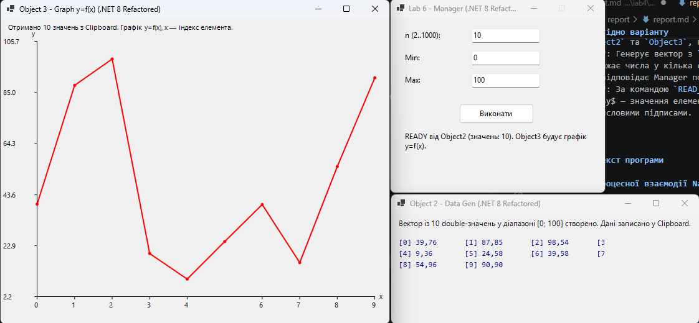

<div style="text-align: center; font-size: 24px; margin-top: 60px;">

Міністерство освіти і науки України

Національний технічний університет України
«Київський політехнічний інститут імені Ігоря Сікорського»

Факультет інформатики та обчислювальної техніки
Кафедра обчислювальної техніки

</div>

<div style="text-align: center; margin-top: 120px;">

<h1 style="font-size: 22px;">Лабораторна робота №6</h1>

<h2 style="font-size: 22px;">з дисципліни «Об'єктно-орієнтоване програмування»</h2>

<h3 style="font-size: 22px; margin-top: 20px;">на тему</h3>

<h2 style="font-size: 22px;">«Побудування програмної системи з множини об'єктів, керованих повідомленнями»</h2>

</div>

<div style="text-align: right; margin-top: 120px; font-size: 18px;">

<strong>Виконав:</strong><br>
Мащута Олександр<br>
студент групи IM-051<br>
номер у списку групи: 7<br><br>

<strong>Перевірив:</strong><br>
Рекечинський Дмитро Олександрович

</div>

<div style="text-align: center; margin-top: 120px; font-size: 20px;">

Київ 2026

</div>

---

## Завдання

1. Розробити програмну систему із трьох незалежних додатків C# WinForms (`Manager`, `Object2`, `Object3`).
2. Реалізувати механізм міжпроцесної взаємодії (IPC) за допомогою повідомлень Windows `WM_COPYDATA`.
3. Використати системний буфер обміну (Windows Clipboard) для передачі масиву значень між процесами.
4. Забезпечити автоматичний запуск, пошук і закриття супутніх процесів при завершенні програми-менеджера.
5. Налагодити систему та перевірити точність обчислень та відображення графіка.
6. Оформити звіт.

---

## Завдання згідно варіанту

Для студента №7 (Ж = 7, Варіант = Ж mod 4 = 3):
1. **Manager (Lab6)**: Приймає параметри `n, Min, Max` від користувача, шукає/запускає `Object2` та `Object3`, передає параметри через `WM_COPYDATA`.
2. **Object2**: Генерує вектор з `n` дробових чисел (`double`) у діапазоні `Min`..`Max`, відображає числа у кілька стовпчиків і рядків, записує їх у системний Clipboard та відповідає Manager повідомленням `READY`.
3. **Object3**: За командою `READ_CLIPBOARD` зчитує дані з Clipboard і будує графік $y=f(x)$, де $y$ — значення елементів вектора, а $x$ — їхні індекси, з осями координат і числовими підписами.

---

## Вихідний текст програми

### Клас міжпроцесної взаємодії NativeMethods.cs

```csharp
using System;
using System.Runtime.InteropServices;
using System.Windows.Forms;

namespace Lab6.Manager;

internal static class NativeMethods
{
    public const int WM_COPYDATA = 0x004A;
    public const uint SMTO_ABORTIFHUNG = 0x0002;
    public const uint SMTO_NORMAL = 0x0000;

    [StructLayout(LayoutKind.Sequential)]
    public struct COPYDATASTRUCT
    {
        public IntPtr dwData;
        public int cbData;
        public IntPtr lpData;
    }

    [DllImport("user32.dll", CharSet = CharSet.Unicode, SetLastError = true)]
    public static extern IntPtr SendMessageTimeout(
        IntPtr hWnd,
        uint Msg,
        IntPtr wParam,
        ref COPYDATASTRUCT lParam,
        uint fuFlags,
        uint uTimeout,
        out IntPtr lpdwResult);

    public static bool SendCopyData(IntPtr hWndDest, IntPtr hWndSrc, int dwData, string text, uint timeoutMs = 3000)
    {
        if (hWndDest == IntPtr.Zero) return false;

        GCHandle handle = GCHandle.Alloc(text, GCHandleType.Pinned);
        try
        {
            var cds = new COPYDATASTRUCT
            {
                dwData = (IntPtr)dwData,
                cbData = text.Length * sizeof(char),
                lpData = handle.AddrOfPinnedObject()
            };

            IntPtr ret = SendMessageTimeout(
                hWndDest,
                WM_COPYDATA,
                hWndSrc,
                ref cds,
                SMTO_ABORTIFHUNG | SMTO_NORMAL,
                timeoutMs,
                out _);

            return ret != IntPtr.Zero;
        }
        finally
        {
            handle.Free();
        }
    }

    public static (IntPtr dwData, string text) ParseCopyData(Message m)
    {
        if (m.LParam == IntPtr.Zero) return (IntPtr.Zero, string.Empty);
        var cds = Marshal.PtrToStructure<COPYDATASTRUCT>(m.LParam);
        if (cds.cbData <= 0 || cds.lpData == IntPtr.Zero)
            return (cds.dwData, string.Empty);

        string text = Marshal.PtrToStringUni(cds.lpData, cds.cbData / sizeof(char)) ?? string.Empty;
        return (cds.dwData, text);
    }
}
```

### Програма Manager (ManagerForm.cs)

```csharp
using System;
using System.Collections.Concurrent;
using System.Diagnostics;
using System.Drawing;
using System.Globalization;
using System.IO;
using System.Threading;
using System.Threading.Tasks;
using System.Windows.Forms;

namespace Lab6.Manager;

public class ManagerForm : Form
{
    internal const int MsgParams = 1;        // Manager -> Object2
    internal const int MsgReady = 2;         // Object2 -> Manager
    internal const int MsgReadClipboard = 3; // Manager -> Object3

    private readonly TextBox _txtN;
    private readonly TextBox _txtMin;
    private readonly TextBox _txtMax;
    private readonly Button _btnRun;
    private readonly Label _lblStatus;
    private int _yPos = 20;

    private readonly ConcurrentBag<Process> _companions = [];
    private CancellationTokenSource? _cts;
    private IntPtr _object3HWnd = IntPtr.Zero;

    public ManagerForm()
    {
        Text = "Lab 6 - Manager (.NET 8 Refactored)";
        Size = new Size(360, 320);
        StartPosition = FormStartPosition.Manual;
        Location = new Point(30, 40);
        FormBorderStyle = FormBorderStyle.FixedSingle;
        MaximizeBox = false;

        AddInput("n (2..1000):", _txtN = new TextBox { Text = "10" });
        AddInput("Min:", _txtMin = new TextBox { Text = "0" });
        AddInput("Max:", _txtMax = new TextBox { Text = "100" });

        _btnRun = new Button { Text = "Виконати", Location = new Point(110, _yPos + 10), Size = new Size(120, 32) };
        _btnRun.Click += OnRunClicked;
        Controls.Add(_btnRun);

        _lblStatus = new Label
        {
            Text = "Готовий до запуску системи.",
            Location = new Point(20, _yPos + 55),
            Size = new Size(310, 55)
        };
        Controls.Add(_lblStatus);

        FormClosed += (_, _) => CloseCompanions();
    }

    private void AddInput(string labelText, TextBox tb)
    {
        Label lbl = new Label { Text = labelText, Location = new Point(20, _yPos), AutoSize = true };
        tb.Location = new Point(130, _yPos - 3);
        tb.Size = new Size(110, 22);
        Controls.Add(lbl);
        Controls.Add(tb);
        _yPos += 36;
    }

    private async void OnRunClicked(object? sender, EventArgs e)
    {
        _cts?.Cancel();
        _cts?.Dispose();
        _cts = new CancellationTokenSource();
        CancellationToken token = _cts.Token;

        if (!int.TryParse(_txtN.Text, out int n) || n is < 2 or > 1000)
        {
            MessageBox.Show("Кількість значень n: ціле число від 2 до 1000.",
                "Помилка валідації", MessageBoxButtons.OK, MessageBoxIcon.Warning);
            return;
        }

        if (!double.TryParse(_txtMin.Text, NumberStyles.Float, CultureInfo.InvariantCulture, out double min) ||
            !double.TryParse(_txtMax.Text, NumberStyles.Float, CultureInfo.InvariantCulture, out double max) || min >= max)
        {
            MessageBox.Show("Діапазон: дійсні числа Min < Max.",
                "Помилка валідації", MessageBoxButtons.OK, MessageBoxIcon.Warning);
            return;
        }

        _btnRun.Enabled = false;
        _lblStatus.Text = "Пошук/запуск Object2 та Object3...";

        try
        {
            Process p2 = FindOrStart("Object2");
            Process p3 = FindOrStart("Object3");

            IntPtr h2 = await WaitForWindowAsync(p2, token: token);
            IntPtr h3 = await WaitForWindowAsync(p3, token: token);

            if (h2 == IntPtr.Zero || h3 == IntPtr.Zero)
            {
                _lblStatus.Text = "Помилка: не вдалося знайти вікна Object2/Object3 (таймаут).";
                return;
            }

            _object3HWnd = h3;

            string payload = string.Join(";",
                n.ToString(CultureInfo.InvariantCulture),
                min.ToString(CultureInfo.InvariantCulture),
                max.ToString(CultureInfo.InvariantCulture));

            bool sent = NativeMethods.SendCopyData(h2, Handle, MsgParams, payload);
            _lblStatus.Text = sent
                ? $"Параметри \"{payload}\" надіслані Object2 (WM_COPYDATA). Очікування READY..."
                : "Помилка надсилання даних у Object2 (таймаут/блокування).";
        }
        catch (OperationCanceledException)
        {
            _lblStatus.Text = "Операцію скасовано.";
        }
        catch (Exception ex)
        {
            _lblStatus.Text = $"Помилка: {ex.Message}";
        }
        finally
        {
            _btnRun.Enabled = true;
        }
    }

    protected override void WndProc(ref Message m)
    {
        if (m.Msg == NativeMethods.WM_COPYDATA)
        {
            var (dwData, text) = NativeMethods.ParseCopyData(m);
            if (dwData.ToInt64() == MsgReady && _object3HWnd != IntPtr.Zero)
            {
                bool sent = NativeMethods.SendCopyData(_object3HWnd, Handle, MsgReadClipboard, text);
                _lblStatus.Text = sent
                    ? $"READY від Object2 (значень: {text}). Object3 будує графік y=f(x)."
                    : "Помилка надсилання команди у Object3.";
            }
            m.Result = IntPtr.Zero;
            return;
        }
        base.WndProc(ref m);
    }

    private Process FindOrStart(string name)
    {
        foreach (var p in Process.GetProcessesByName(name))
        {
            try
            {
                p.Refresh();
                if (!p.HasExited && p.MainWindowHandle != IntPtr.Zero)
                {
                    TrackCompanion(p);
                    return p;
                }
            }
            catch
            {
            }
        }

        string exePath = Path.Combine(AppContext.BaseDirectory, $"{name}.exe");
        if (!File.Exists(exePath))
        {
            throw new FileNotFoundException($"Виконуваний файл не знайдено: {exePath}");
        }

        var startInfo = new ProcessStartInfo
        {
            FileName = exePath,
            WorkingDirectory = AppContext.BaseDirectory,
            UseShellExecute = false,
            CreateNoWindow = false
        };

        Process started = Process.Start(startInfo)
            ?? throw new InvalidOperationException($"Не вдалося запустити процес {name}");

        TrackCompanion(started);
        return started;
    }

    private void TrackCompanion(Process p)
    {
        if (!_companions.Contains(p))
        {
            _companions.Add(p);
        }
    }

    private static async Task<IntPtr> WaitForWindowAsync(Process p, int timeoutMs = 10000, CancellationToken token = default)
    {
        var sw = Stopwatch.StartNew();
        while (sw.ElapsedMilliseconds < timeoutMs)
        {
            token.ThrowIfCancellationRequested();
            p.Refresh();
            if (p.HasExited) return IntPtr.Zero;
            if (p.MainWindowHandle != IntPtr.Zero) return p.MainWindowHandle;
            await Task.Delay(100, token);
        }
        return IntPtr.Zero;
    }

    private void CloseCompanions()
    {
        _cts?.Cancel();
        foreach (var p in _companions)
        {
            try
            {
                p.Refresh();
                if (!p.HasExited)
                {
                    p.CloseMainWindow();
                }
            }
            catch
            {
            }
        }
    }
}
```

### Генератор даних Object2 (Object2Form.cs)

```csharp
using System;
using System.Collections.Generic;
using System.Drawing;
using System.Globalization;
using System.Text;
using System.Windows.Forms;

namespace Lab6.Object2;

public class Object2Form : Form
{
    private const int MsgParams = 1; // Manager -> Object2
    private const int MsgReady = 2;  // Object2 -> Manager

    private readonly List<double> _values = [];
    private IntPtr _managerHWnd = IntPtr.Zero;
    private string _status = "Очікування параметрів (n;Min;Max) від Manager через WM_COPYDATA...";

    public Object2Form()
    {
        Text = "Object 2 - Data Gen (.NET 8 Refactored)";
        Size = new Size(460, 380);
        StartPosition = FormStartPosition.Manual;
        Location = new Point(410, 40);
        DoubleBuffered = true;
    }

    protected override void WndProc(ref Message m)
    {
        if (m.Msg == NativeMethods.WM_COPYDATA)
        {
            var (dwData, text) = NativeMethods.ParseCopyData(m);
            if (dwData.ToInt64() == MsgParams)
            {
                _managerHWnd = m.WParam;
                OnParamsReceived(text);
            }
            m.Result = IntPtr.Zero;
            return;
        }
        base.WndProc(ref m);
    }

    private void OnParamsReceived(string text)
    {
        string[] p = text.Split(';');
        if (p.Length < 3 ||
            !int.TryParse(p[0], out int n) || n is < 2 or > 1000 ||
            !double.TryParse(p[1], NumberStyles.Float, CultureInfo.InvariantCulture, out double min) ||
            !double.TryParse(p[2], NumberStyles.Float, CultureInfo.InvariantCulture, out double max) ||
            min >= max)
        {
            _status = $"Отримано некоректні параметри: \"{text}\"";
            Invalidate();
            return;
        }

        _values.Clear();
        _values.EnsureCapacity(n);
        for (int i = 0; i < n; i++)
        {
            _values.Add(min + Random.Shared.NextDouble() * (max - min));
        }

        var sb = new StringBuilder(n * 10);
        for (int i = 0; i < n; i++)
        {
            if (i > 0) sb.Append(';');
            sb.Append(_values[i].ToString("F4", CultureInfo.InvariantCulture));
        }

        try
        {
            Clipboard.SetText(sb.ToString());
            _status = $"Вектор із {n} double-значень у діапазоні [{min}; {max}] створено. Дані записано у Clipboard.";
        }
        catch (Exception ex)
        {
            _status = $"Помилка запису у Clipboard: {ex.Message}";
        }
        Invalidate();

        if (_managerHWnd != IntPtr.Zero)
        {
            BeginInvoke(new Action(() =>
                NativeMethods.SendCopyData(_managerHWnd, Handle, MsgReady, _values.Count.ToString(CultureInfo.InvariantCulture))));
        }
    }

    protected override void OnPaint(PaintEventArgs e)
    {
        base.OnPaint(e);
        Graphics g = e.Graphics;

        using Font statusFont = new Font("Segoe UI", 9f);
        using Font valueFont = new Font("Consolas", 9f);
        g.DrawString(_status, statusFont, Brushes.Black, 10, 8);

        const int cols = 4;
        float cellW = (ClientSize.Width - 20f) / cols;
        for (int i = 0; i < _values.Count; i++)
        {
            float x = 10 + (i % cols) * cellW;
            float y = 40 + (i / cols) * 18f;
            if (y > ClientSize.Height - 20) break;
            g.DrawString($"[{i}] {_values[i]:F2}", valueFont, Brushes.DarkBlue, x, y);
        }
    }
}
```

### Побудовник графіка Object3 (Object3Form.cs)

```csharp
using System;
using System.Collections.Generic;
using System.Drawing;
using System.Drawing.Drawing2D;
using System.Globalization;
using System.Windows.Forms;

namespace Lab6.Object3;

public class Object3Form : Form
{
    private const int MsgReadClipboard = 3; // Manager -> Object3
    private const int MaxClipboardLength = 1_000_000; // Defensive limit (1MB)

    private readonly List<double> _values = [];
    private string _status = "Очікування команди READ_CLIPBOARD від Manager...";

    public Object3Form()
    {
        Text = "Object 3 - Graph y=f(x) (.NET 8 Refactored)";
        Size = new Size(640, 530);
        StartPosition = FormStartPosition.Manual;
        Location = new Point(880, 40);
        DoubleBuffered = true;

        Load += (_, _) => TryReadClipboard();
    }

    protected override void WndProc(ref Message m)
    {
        if (m.Msg == NativeMethods.WM_COPYDATA)
        {
            var (dwData, _) = NativeMethods.ParseCopyData(m);
            if (dwData.ToInt64() == MsgReadClipboard)
            {
                TryReadClipboard();
            }
            m.Result = IntPtr.Zero;
            return;
        }
        base.WndProc(ref m);
    }

    private void TryReadClipboard()
    {
        try
        {
            string data = Clipboard.GetText();
            if (string.IsNullOrWhiteSpace(data) || data.Length > MaxClipboardLength)
            {
                return;
            }

            ReadOnlySpan<char> span = data.AsSpan();
            List<double> parsed = [];

            while (!span.IsEmpty)
            {
                int sepIndex = span.IndexOf(';');
                ReadOnlySpan<char> token = sepIndex < 0 ? span : span[..sepIndex];
                span = sepIndex < 0 ? ReadOnlySpan<char>.Empty : span[(sepIndex + 1)..];

                token = token.Trim();
                if (token.IsEmpty) continue;

                if (!double.TryParse(token, NumberStyles.Float, CultureInfo.InvariantCulture, out double v))
                {
                    return; // Ignore invalid clipboard content
                }
                parsed.Add(v);
            }

            if (parsed.Count == 0) return;

            _values.Clear();
            _values.AddRange(parsed);
            _status = $"Отримано {_values.Count} значень з Clipboard. Графік y=f(x), x — індекс елемента.";
        }
        catch (Exception ex)
        {
            _status = $"Clipboard недоступний: {ex.Message}";
        }
        Invalidate();
    }

    protected override void OnPaint(PaintEventArgs e)
    {
        base.OnPaint(e);
        Graphics g = e.Graphics;
        g.SmoothingMode = SmoothingMode.AntiAlias;

        using Font font = new Font("Segoe UI", 8.5f);
        g.DrawString(_status, font, Brushes.Black, 10, 6);

        if (_values.Count < 2)
        {
            g.DrawString("Недостатньо даних для побудови графіка.", font, Brushes.Gray, 30, 60);
            return;
        }

        int ml = 58, mr = 24, mt = 36, mb = 44;
        int pw = ClientSize.Width - ml - mr;
        int ph = ClientSize.Height - mt - mb;
        if (pw <= 10 || ph <= 10) return;

        double yMin = double.MaxValue, yMax = double.MinValue;
        foreach (var v in _values)
        {
            if (v < yMin) yMin = v;
            if (v > yMax) yMax = v;
        }
        double pad = (yMax - yMin) * 0.08;
        if (pad < 1e-9) pad = 1.0;
        yMin -= pad; yMax += pad;

        int n = _values.Count;
        Func<int, float> mapX = i => ml + pw * (i / (float)(n - 1));
        Func<double, float> mapY = v => mt + ph * (1f - (float)((v - yMin) / (yMax - yMin)));

        using Pen axisPen = new Pen(Color.Black, 1.4f);
        g.DrawLine(axisPen, ml, mt, ml, mt + ph);
        g.DrawLine(axisPen, ml, mt + ph, ml + pw, mt + ph);

        int xTicks = Math.Min(n - 1, 8);
        for (int t = 0; t <= xTicks; t++)
        {
            int idx = (int)Math.Round(t * (n - 1) / (double)xTicks);
            float x = mapX(idx);
            g.DrawLine(axisPen, x, mt + ph, x, mt + ph + 4);
            g.DrawString(idx.ToString(CultureInfo.InvariantCulture), font, Brushes.Black, x - 6, mt + ph + 6);
        }

        const int yTicks = 5;
        for (int t = 0; t <= yTicks; t++)
        {
            double v = yMin + (yMax - yMin) * t / yTicks;
            float y = mapY(v);
            g.DrawLine(axisPen, ml - 4, y, ml, y);
            g.DrawString(v.ToString("F1", CultureInfo.InvariantCulture), font, Brushes.Black, 2, y - 7);
        }

        g.DrawString("x", font, Brushes.Black, ml + pw + 6, mt + ph - 8);
        g.DrawString("y", font, Brushes.Black, ml - 10, mt - 20);

        PointF[] pts = new PointF[n];
        for (int i = 0; i < n; i++)
        {
            pts[i] = new PointF(mapX(i), mapY(_values[i]));
        }

        using Pen graphPen = new Pen(Color.Red, 2f);
        g.DrawLines(graphPen, pts);
        foreach (var pt in pts)
        {
            g.FillEllipse(Brushes.Red, pt.X - 2.5f, pt.Y - 2.5f, 5f, 5f);
        }
    }
}
```

---

## Діаграми

### Діаграма компонентів та передачі даних

```
┌──────────────┐  WM_COPYDATA (dwData=1: n,Min,Max)   ┌──────────────┐
│   Manager    │─────────────────────────────────────▶│   Object2    │
│   (Lab6)     │                                      │ (Генерація   │
│              │◀─────────────────────────────────────│  вектора     │
│              │  WM_COPYDATA (dwData=2: READY)       │  → Clipboard)│
│              │                                      └──────────────┘
│              │  WM_COPYDATA (dwData=3: READ)        ┌──────────────┐
│              │─────────────────────────────────────▶│   Object3    │
└──────────────┘                                      │ (Читання     │
       │ Закриття Manager                             │ Clipboard →  │
       └─────────────────────────────────────────────▶│  графік y=f(x)│
                                                      └──────────────┘
```

---

## Скріншоти

### Три вікна системи в роботі

_Рис. 1. Одночасна робота трьох процесів: Manager, Object2 та Object3_

## Висновки

У лабораторній роботі №6 було розроблено розподілену програмну систему із трьох C# WinForms додатків, що взаємодіють між собою за допомогою обміну повідомленнями `WM_COPYDATA` та системного буфера обміну `Clipboard`.

Програма `Manager` автоматично контролює життєвий цикл супутніх процесів, передає вхідні параметри `Object2`, а після завершення генерації даних повідомляє `Object3` про необхідність побудови графіка $y=f(x)$. Систему повністю налагоджено, виключено зациклення `SendMessage` та забезпечено автоматичне завершення всіх вікон при виході з головної програми.
